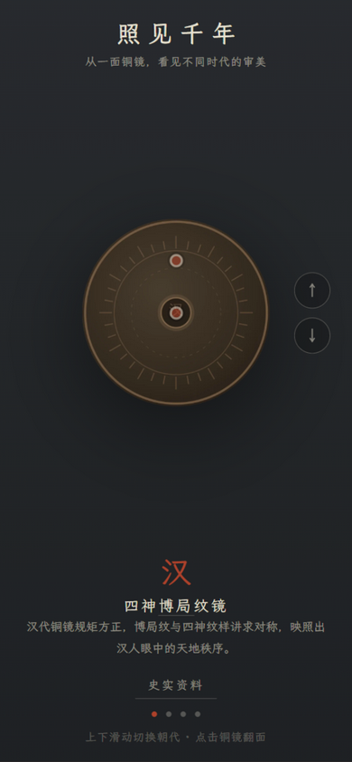
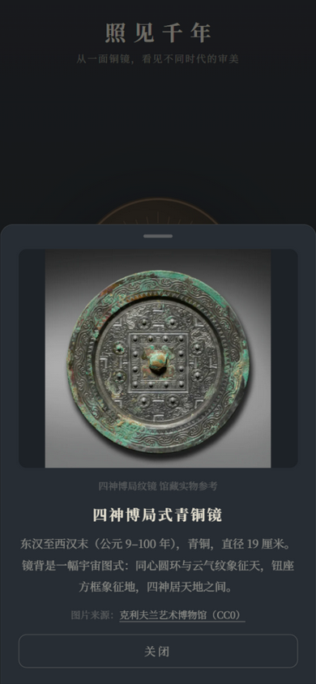
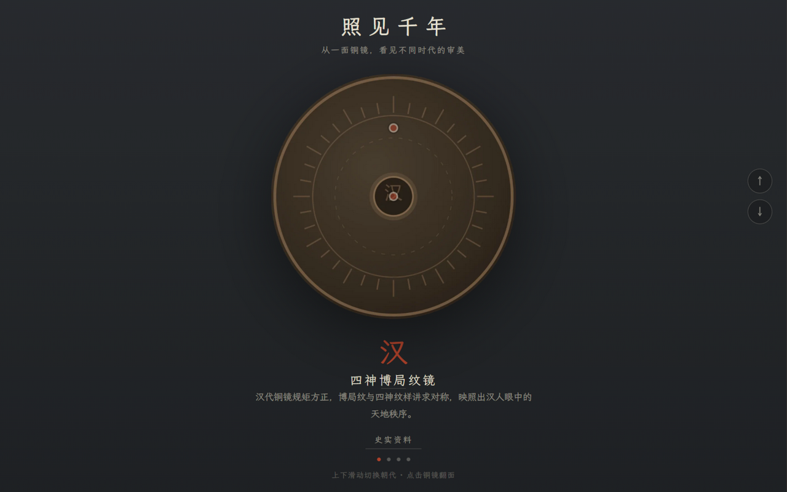

# 照见千年 · 铜镜小展览

> 从一面铜镜，看见不同时代的审美。

一个偏国风、博物馆体验的互动小工具：滑动切换 **汉 → 唐 → 宋 → 明** 四个朝代的代表性铜镜，点击翻面，触摸纹样热点阅读说明，查看馆藏史实资料。为小红书「小工具」（Builder Hub）设计，同时保留扩展为普通网站的能力。

| 移动端 | 馆藏史实资料卡 | 桌面端 |
|---|---|---|
|  |  |  |

## 功能

- **上下滑动切换朝代**（循环），拖动跟手、松手回弹；桌面端支持滚轮、方向键、侧边按钮
- **点击铜镜翻面**：CSS 3D 沿 Y 轴翻转，650ms 缓动，默认展示纹样更丰富的镜背
- **纹样热点**：在镜背停留 1.6 秒后轻微浮现，点击弹出底部信息卡
- **史实资料**：每面镜子预留馆藏参考位，汉、唐已配克利夫兰艺术博物馆 CC0 实拍图，宋、明待补
- 移动端优先：全屏固定布局，纵向手势完全让给朝代切换

## 技术栈

Vite · React 18 · TypeScript · Framer Motion · 原生 CSS（无 UI 框架）

## 快速开始

```bash
npm install
npm run dev        # http://localhost:6180
npm run build      # 类型检查 + 产物构建（dist/）
npm run preview    # 预览构建产物（http://localhost:6181）
```

## 工程脚本

| 命令 | 用途 |
|---|---|
| `npm run placeholders` | 生成 8 张占位镜面图（正式素材到位前的开发用图） |
| `npm run font:subset` | 霞鹜文楷子集化：扫描源码全部用字，输出 `src/fonts/*.woff2`（新增文案后需重跑） |

## 目录速览

```text
assets/            # 静态资源根（镜面图、馆藏参考图）
src/
  data/mirrors.ts  # 全部内容配置：文案、图片路径、热点坐标、史实资料
  components/      # MirrorStage / MirrorFlip / Hotspot / InfoCard
  fonts/           # 霞鹜文楷子集（构建期生成，入库）
scripts/           # 占位图 / 字体子集化脚本
docs/screenshots/  # README 展示图
```

内容全部数据驱动：加一面镜子 = 在 `mirrors.ts` 加一条配置 + 放两张图，组件零改动。

## 素材与授权

- **馆藏参考图**：克利夫兰艺术博物馆开放授权（CC0）——[四神博局式青铜镜](https://clevelandart.org/art/1995.301)、[瑞兽葡萄镜](https://clevelandart.org/art/1995.356)
- **字体**：[霞鹜文楷（LXGW WenKai）](https://github.com/lxgw/LxgwWenkai)，SIL OFL 1.1，子集化后本地打包
- **镜面主视觉**：当前为脚本生成的占位图，正式美术素材按 `PROGRESS.md` 第八节规格接入
- 目标平台为小红书小工具沙箱：**零网络请求**，全部资源本地打包

## 开发进度

设计文档见 [SLC.md](SLC.md)，决策与进度记录见 [PROGRESS.md](PROGRESS.md)。
