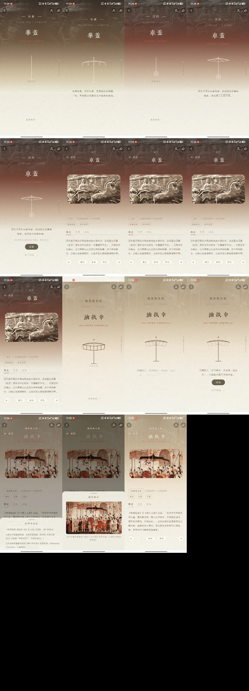
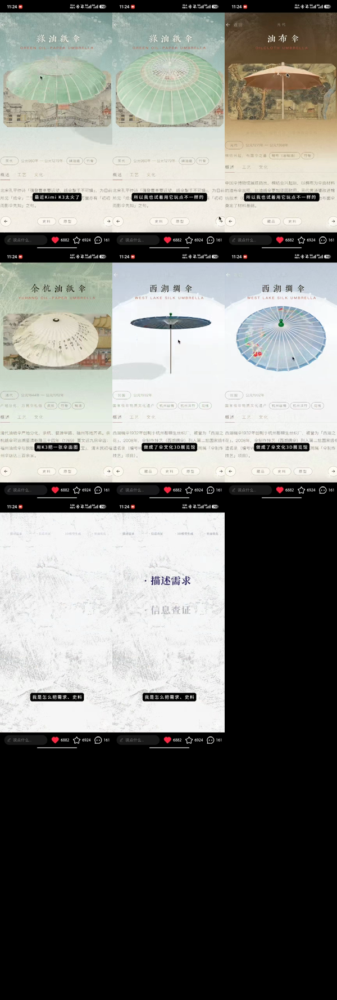

# 视频切分与效果说明（storyboard）

本文件用于把 `um1.mp4` 与 `um2.mp4` 的**界面效果**传达给另一个 coding agent。
视频是**手机 App 的中文博物馆/非遗主题应用**（伞的历史与伞文化）界面录屏，作者在画面上加了黑色字幕气泡。

> 说明：coding agent 无法直接「播放」视频，因此按**场景切换**把视频切成若干片段（`*-seg-*.mp4`），
> 每段配一张**关键帧截图**（`*frames/keyframe-seg-*.png`，取该段中间位置），并附文字说明。
> 若对方 agent 支持读图/多模态，请它重点看关键帧；若只支持文字，请以本文件的文字描述为准。

---

## 视频规格

| 文件 | 分辨率 | 帧率 | 时长 | 编码 |
| --- | --- | --- | --- | --- |
| um1.mp4 | 576×1280 (竖屏) | 24 fps | 29.33 s | HEVC + AAC |
| um2.mp4 | 576×1280 (竖屏) | 24 fps | 11.42 s | HEVC + AAC |

切分时已重新编码为 H.264 + AAC（兼容性更好），关键帧为 576×1280 PNG。

---

## 公共 UI 组件（两段视频共用的「效果/界面元素」）

无论要还原还是理解这个 App，以下元素在多个片段里反复出现：

- **顶部状态栏**：时间（11:24）、网络（5G）、电量。
- **顶部导航栏**：左侧「← 返回」返回按钮；右侧「账号图标」+「分享图标」。
- **章节引导页（entry screen）**：大标题（中文 + 英文副标题，如「华盖 IMPERIAL CANOPY」）、
  线稿插图、时期副标题（如「公元前 206 年 — 公元 220 年」）、一段介绍文字、
  深色圆角「观展」CTA 按钮、下方「向下滑动」提示、**右侧竖向圆点页码指示器**。
- **内容详情页（detail page）**：顶部大图（文物/画作）、标题（中文+英文）、
  时期标签胶囊（如「汉代」「公元前206年—公元220年」）+ 材料标签胶囊（如「丝帛盖衣」「木竹盖弓」）、
  三个内容 Tab（**概述 / 工艺 / 文化**）、正文长段落。
- **底部导航行**：`← 箭头 | 藏品 / 史料 / 原型 按钮 | → 箭头`。
- **底部社交/评论栏**：输入框「说点什么...」、`❤ 6882`、`☆ 6924`、`💬 161`。
- **过渡效果**：章节页与详情页之间为竖向滑动/淡入；右侧分页圆点随页面切换。
- **作者叠加的字幕气泡**（黑色半透明，带白字）：如「最近Kimi K3太火了」「所以我也试着用它玩点不一样的」「用K3把一张伞面图」「接下来分享」。
- **配色**：纸张/黄褐色暖调（契合「油纸伞」主题），标题与部分元素用暗红色点缀。

---

## um1.mp4（29.33 s，5 段）—— 按历史时期推进：先秦→汉代→魏晋南北朝

| 段 | 时间段 | 片段文件 | 关键帧 | 内容与效果 |
| --- | --- | --- | --- | --- |
| 00 | 00:00–00:03.7 | `um1/um1-seg-00.mp4` | `um1/frames/keyframe-seg-00.png` | 先秦时期「**华盖 IMPERIAL CANOPY**」封面/引导页。线稿华盖插图 + 时期副标题「约公元前11世纪 — 公元前221年」，背景为做旧的画作，整体暖黄色调，右侧有竖向分页圆点。效果：开场封面，标题淡入。 |
| 01 | 00:03.7–00:15.1 | `um1/um1-seg-01.mp4` | `um1/frames/keyframe-seg-01.png` | 汉代「**车盖 CHARIOT CANOPY**」章节引导页。半透明标题块「汉代 公元前206年—公元220年 车盖」，一张**车马铜饰浮雕大图**由下向上浮现，深色「观展」按钮出现。效果：入口/进场动画（内容图 + CTA 按钮上浮）。 |
| 02 | 00:15.1–00:18.5 | `um1/um1-seg-02.mp4` | `um1/frames/keyframe-seg-02.png` | 「**车盖**」内容详情页。石头浮雕照片、标签胶囊（汉代 / 丝帛盖衣 / 木竹盖弓）、「概述/工艺/文化」Tab、正文段落、底部导航（← 藏品/史料/原型 →）。效果：静态详情排版 + Tab 阅读 UI。 |
| 03 | 00:18.5–00:26.5 | `um1/um1-seg-03.mp4` | `um1/frames/keyframe-seg-03.png` | 魏晋南北朝「**油纸伞 OIL-PAPER UMBRELLA**」章节引导页。线稿伞插图、时期副标题「公元220年—公元589年」、正文提到北魏「以竹为骨，刷桐油」、深色「观展」按钮 +「向下滑动」提示 + 右侧分页圆点。效果：第二处章节引导页（与 seg-01 同一套进场模式，换新画面）。 |
| 04 | 00:26.5–00:29.3 | `um1/um1-seg-04.mp4` | `um1/frames/keyframe-seg-04.png` | 「**油纸伞**」内容详情页。一幅清明风格古画（人群中多把伞）、标签胶囊（魏晋南北朝 / 油纸 / 丝罗 / 竹骨）、「概述/工艺/文化」Tab、引用《格致镜原》的正文、底部导航（← 史料/原型 →）。效果：第二处内容详情排版。 |

---

## um2.mp4（11.42 s，4 段）—— 快速上下滑动切换 4 个伞品详情页

| 段 | 时间段 | 片段文件 | 关键帧 | 内容与效果 |
| --- | --- | --- | --- | --- |
| 00 | 00:00–00:02.5 | `um2/um2-seg-00.mp4` | `um2/frames/keyframe-seg-00.png` | 宋代「**绿油纸伞 GREEN OIL-PAPER UMBRELLA**」。绿色水彩伞大图、标签胶囊（宋代 公元960年—公元1279年 / 绿油纸 / 竹骨）、概述正文提到孔平仲「强登曹亭要望远」、底部导航、社交栏（❤6882 / ☆6924 / 💬161）。 |
| 01 | 00:02.5–00:04.3 | `um2/um2-seg-01.mp4` | `um2/frames/keyframe-seg-01.png` | 元代「**油布伞 OILCLOTH UMBRELLA**」。黄褐色油布伞（村野河岸画背景）、标签胶囊（元代 公元1271年—公元1368年 / 棉布（涂桐油）/ 竹骨）、正文提到中国伞博物馆、底部导航（藏品/史料）、社交栏。 |
| 02 | 00:04.3–00:06.7 | `um2/um2-seg-02.mp4` | `um2/frames/keyframe-seg-02.png` | 清代「**余杭油纸伞 YUHANG OIL-PAPER UMBRELLA**」。带书法的白伞大图、标签胶囊（清代 公元1644年—公元1912年 / 皮纸 / 竹骨 / 桐油）、正文提到四川/福州油纸伞、底部导航、社交栏。 |
| 03 | 00:06.7–00:11.4 | `um2/um2-seg-03.mp4` | `um2/frames/keyframe-seg-03.png` | 民国「**西湖绸伞 WEST LAKE SILK UMBRELLA**」。浅蓝绸伞（含花线图案）大图、标签胶囊（民国 公元1932年 / 杭州丝绸 / 杭州淡竹 / 花线）、正文提到1932年杭州都锦生丝织厂、国家级非物质文化遗产、底部导航、社交栏。本段最长，含结尾过渡。 |

---

## 给 agent 的读取建议

1. 先看以上两个「总览」contact sheet，了解整体结构。
2. 需要具体某个效果时，打开对应 `*-seg-*.mp4` 片段，或查看对应 `keyframe-seg-*.png`。
3. 关键帧取自每段**中间时刻**；若需查看段内其它时刻，可在原片段上用 FFmpeg 按时间抽帧（如 `ffmpeg -ss <秒> -i <片段> -frames:v 1 out.png`）。
